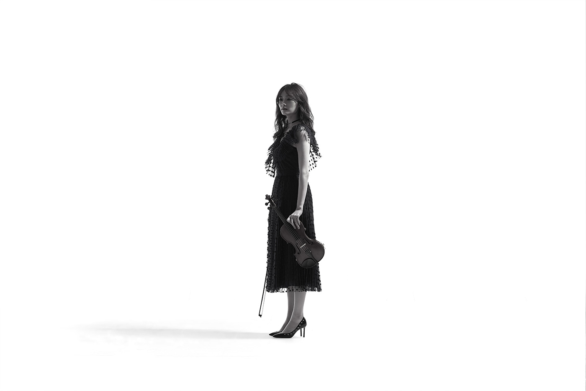

# JavaScript Image Animation
> This project shows how to use images to make smooth and attractive animations on the web page. One can do interesting work using the logic I have built. 

## Usage example

These animation can be used to make story telling like user experience. Someone visits your website and on scroll, he/she sees amazing graphics rooming around. 

## How to run

Just simply clone repository and open html file and scroll to see the magic. 

## Meta

Asad Ullah Khalid – [@LinkedIn](https://www.linkedin.com/in/asadkhalid305/) – asadkhalid305@gmail.com

[https://github.com/asadkhalid305/](https://github.com/asadkhalid305/)

Distributed under the MIT license.

## Contributing

1. Fork it (<https://github.com/asadkhalid305/dancing-girl-image-animation/fork>)
2. Create your feature branch (`git checkout -b feature/fooBar`)
3. Commit your changes (`git commit -am 'Add some fooBar'`)
4. Push to the branch (`git push origin feature/fooBar`)
5. Create a new Pull Request